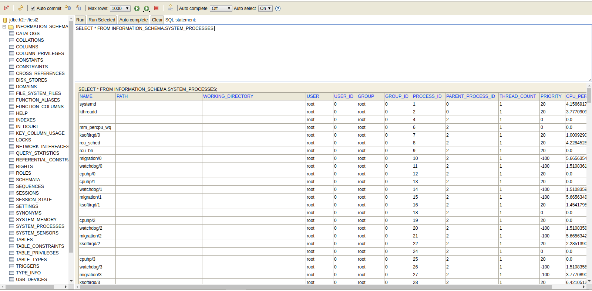

# The H2 System Information Integration Project (h2-sys).

This project is a personal experiment to embed System Information (Hardware / Software) capabilities in a database that can easily be queried, as well as embedded into any embedded platfrom. As an experiment, it is still a work in progress, but it is also a proof of concept.

H2 is a lightweight Java Database that has sophisticated features, and is easily 2 MB in footprint. Making it easy to embed in any Embedded System.

## How we did this

1. We took the [H2 Database](https://h2database.com/)
2. We took [Oshi](https://github.com/oshi/oshi/)
3. We married the capabilities of the 2

## System Tables

We integrated the following tables as part of `INFORMATION_SCHEMA`:

1. `SYSTEM_PROCESSES` (List of System Processes)
2. `FILE_SYSTEM_FILES` (File Systems)
3. `DISK_STORES` (Disk Stores / Disks)
4. `NETWORK_INTERFACES` (The Active Network Interfaces)
5. `SYSTEM_MEMORY` (RAM / Swap Metrics)
6. `SYSTEM_SENSORS` (Data from CPU - Temperature / Voltage)
7. `USB_DEVICES` (Connected USB devices)

## Examples:

1. `SYSTEM_PROCESSES` : `SELECT * FROM INFORMATION_SCHEMA.SYSTEM_PROCESSES`

2. `SYSTEM_PROCSSES` with a `WHERE` clause: `SELECT * FROM INFORMATION_SCHEMA.SYSTEM_PROCESSES where USER='ahmed'`

# Welcome to H2, the Java SQL database (H2 Original README).

## The main features of H2 are:

1. Very fast, open source, JDBC API
2. Embedded and server modes; in-memory databases
3. Browser based Console application
4. Small footprint: around 2 MB jar file size

More information: https://h2database.com

## Features

| | [H2](https://h2database.com/) | [Derby](https://db.apache.org/derby) | [HSQLDB](http://hsqldb.org) | [MySQL](https://www.mysql.com/) | [PostgreSQL](https://www.postgresql.org) |
|--------------------------------|---------|---------|---------|-------|---------|
| Pure Java                      | Yes     | Yes     | Yes     | No    | No      |
| Memory Mode                    | Yes     | Yes     | Yes     | No    | No      |
| Encrypted Database             | Yes     | Yes     | Yes     | No    | No      |
| ODBC Driver                    | Yes     | No      | No      | Yes   | Yes     |
| Fulltext Search                | Yes     | No      | No      | Yes   | Yes     |
| Multi Version Concurrency      | Yes     | No      | Yes     | Yes   | Yes     |
| Footprint (embedded database)  | ~2 MB   | ~3 MB   | ~1.5 MB | —     | —       |
| Footprint (JDBC client driver) | ~500 KB | ~600 KB | ~1.5 MB | ~1 MB | ~700 KB |

